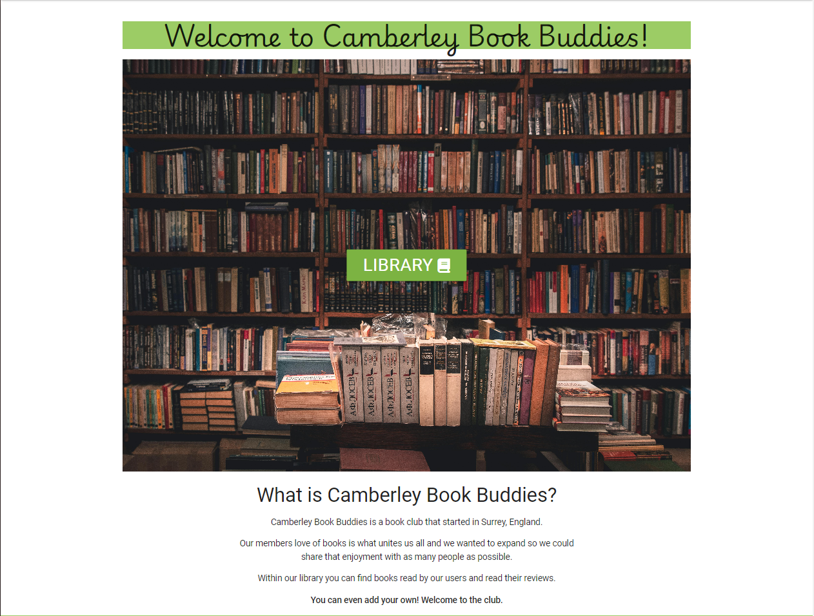

# Camberley Book Buddies

Camberley Book Buddies is a book club based in that has recently decided it needs a website to cater to a larger audience and promote further engagement with it's members. The sites target audience is anyone who enjoys reading books, particularly those local to the club. The website should be beneficial to it's users as they will be able to find information on the books that have been read by the club and read or give their own opinions in the form of reviews.

## Table of Contents

**[1. User Experience](#user-experience)**
* [1.1 User Information](#user-information)
* [1.2 Design](#design)
* [1.3 User Stories](#user-stories)

**[2. Features](#features)**
* [2.1 Existing Features](#existing-features)
* [2.2 Features Left to Implement](#features-left-to-implement)

**[3. Testing](#testing)**

**[4. Technologies](#technologies)**
* [4.1 Languages](#languages)
* [4.2 Libraries & Programs Used](#libraries--programs-used)

**[5. Deployment](#deployment)**  
* [5.1 Deploying this repository](#deploying-this-repository)
* [5.2 Cloning this repository](#cloning-this-repository)
* [5.3 Forking this repository](#forking-this-repository)

**[6. Credits](#credits)**
* [6.1 Media](#media)
* [6.2 Code](#code)

## User Experience

### User Information

#### Typical Users

The main users of the site will be:
* Casual readers - People new to reading and looking for likeminded people to share their newfound hobby with.
* Reading enthusiasts - People who love to read books every day and are always looking for something to read.

#### User Stories

* As a casual reader, I am looking for somewhere I can find recommendations on new books and authors.
* As a casual reader, I am looking to find new friends and socialize with others.
* As a reading enthusiast, I am looking to guide new readers towards my favourite books.
* As a reading enthusiast, I am looking to share ideas about books with likeminded people.
* As a reading enthusiast, I am looking to add books that I have read when I finish them. 

### Design

#### Typography

There are two fonts in use for the website, both taken from google fonts. The first is Playwrite England Joined, which was selected because it is a calligraphy like style and is much more unique to the user. The elegancy of the font is quite fitting for a book club. The second font selected is Roboto. Roboto was chosen for it's simplicity and popularity, the text is much easier to read than the heading font so it should improve user experience.

#### Icons

##### Book Reader

The book-open-reader icon from fontawesome was selected for the logo because it fits well with the theme of a book club. This is because it shows a person reading from a book and helps provide context to first time users. The solid version was selected because it displays best against the headers green background.

##### Home Icon

The house icon from fontawesome was selected for the home link icon because it is one of the most universally used and easily recognised. The solid version displays best alongside the other links. 

##### Library Icon

The book icon from fontawesome was selected for the call to action button in the hero image and library link. The closed book is to represent the fact you have not yet opened the library. It also makes the button more interesting and eye-catching to the user. 

##### Library Title Icon

The book open icon from fontawesome was selected for the library page heading. This is different from the links to convey to the user they have opened the library page. It displays well in the heading and makes it more interesting.

##### Add Icon

The plus icon from fontawesome was selected for the add book and add review buttons as it makes it very clear to the user that they are for adding new records. It improves the overall look of the button and makes them easier to find at a glance.

##### Edit Icon

The pen to square icon from fontawesome was selected for all edit buttons because it is a well known symbol used to convey the purpose of the button. It should immediately be clear to the user what they can expect from the link.

##### Reviews Icon

The users icon from fontawesome was selected for the reviews link in each books card. It does well to symbolize the community aspect of the reviews feature. The icon and text are displayed in the opposite order to the edit link as it looks better, especially on certain screen widths.

##### Contact Icon

The phone icon from fontawesome was selected for the contact link because it is a good way of letting the user know they will be able to find the telephone number and ways to get in touch with the club. The solid version looks good with the other links. 

##### Facebook

The square facebook icon from fontawesome was selected for the link because it displays better against the footers green background. It is clear to the user what it represents and that it will redirect them to facebook should they click it. It matches the other icons from the footer.

##### Instagram

The square instagram icon from fontawesome was selected for the link because it displays better against the footers green background. It is clear to the user what it represents and that it will redirect them to instagram should they click it. It matches the other icons for the footer.

##### X

The square X icon from fontawesome was selected for the link because it displays better against the footers green background. It is clear to the user what it represents and that it will redirect them to X should they click it. It matches the other icons for the footer.

##### Tik Tok

The tik tok icon from fontawesome was selected for the link because it also displays well against the footers green background. It too is clear to the user what is represents and that it will direct them to tik tok should they click it. Unfortunately fontawesome does not have a square version of the logo but it still looks good alongside the others.

#### Wireframes

##### Home

[index.html](https://github.com/JCook22/camberley-book-buddies/blob/main/camberleybookbuddies/static/images/wireframes/index-wireframe.png?raw=true)

##### Library

[library.html](https://github.com/JCook22/camberley-book-buddies/blob/main/camberleybookbuddies/static/images/wireframes/library-wireframe.png?raw=true)

##### Add Book

[add_book.html](https://github.com/JCook22/camberley-book-buddies/blob/main/camberleybookbuddies/static/images/wireframes/add-book-wireframe.png?raw=true)

##### Edit Book

[edit_book.html](https://github.com/JCook22/camberley-book-buddies/blob/main/camberleybookbuddies/static/images/wireframes/edit-book-wireframe.png?raw=true)

##### Add Review

[add_review.html](https://github.com/JCook22/camberley-book-buddies/blob/main/camberleybookbuddies/static/images/wireframes/add-review-wireframe.png?raw=true)

##### Edit Review

[edit_review.html](https://github.com/JCook22/camberley-book-buddies/blob/main/camberleybookbuddies/static/images/wireframes/edit-review-wireframe.png?raw=true)

##### Contact

[contact.html](https://github.com/JCook22/camberley-book-buddies/blob/main/camberleybookbuddies/static/images/wireframes/contact-wireframe.png?raw=true)

## Features

### Existing Features

#### Header & Navbar

The navbar is displayed in the header at the top of the page. On small screens the company logo is reduced to a acronym and shifted to the center, the links are reduced to a sidenav. The navbar features three links to the main pages; home, library and contact. The logo also acts as a home page link.

#### Hero Image & Call To Action

The hero image is designed to grab the attention of the visitor as soon as they load the page. It features bookshelves to fit the theme of a library and the books within. The library call to action button sits in the middle of the hero image, the green colour constrasts well against the image and the user is naturally drawn to it.

#### Library

The library page is the main feature because it contains the database and the majority of the interactive features. Each book currently added to the database is displayed in alphabetical order, each with it's own Edit and Reviews button links. Above the books is a further 2 link buttons, one for Add Book and another for Add Review.

#### Add Book

The add book button can be found on the library page and brings the user to the add book page. The form is simple with only 3 fields to make adding books as easy as possible. There is validation in place to ensure that the user doesn't leave fields blank or go over character limits. Should the user have any errors they are displayed at the bottom of the form above the submit button. 

#### Edit Book

The edit book button can be found on the cards containing the books in the library. If clicked the user is taken to the edit book page. The form is identical to the add book form however the fields come pre-filled with the existing book information. The user must click the save changes button at the bottom of the form if they want to update any of the fields, the new information must meet the same data validation rules as adding books. There is a delete book button should the user wish to remove a book completely, this will also delete any related reviews.

#### Reviews

The reviews page is reached by clicking the reviews button on an individual book. It will show the reviews in a list on the page, sorted in alphabetical order of the review headline. The user must click on a review to see more information about it or find the edit button which leads to the edit review page. Above the books are 2 buttons, one for going back to library page and one for adding a new review. 

#### Add Review

The add review button is found in the library and on the reviews page for each book. It leads the user to the add review page, which contains a simple 4 field form. Rather than enter the book name manually, the user can select one from the dropbox list provided. There is validation to ensure the user does not leave any fields blank and character limits for all 3. When the user is finished they can click the submit button which should take them back to reviews where they can see what they just created.

#### Edit Review

The edit review button is found in each reviews card when the user expands them for more information. It takes the user to the edit review page which is very similar to the add review form except the fields will be pre-filed with the current data. When the user has finished making changes they can click save changes. There is also a delete button should the user wish to delete the review.

#### Contact Page

The contact page is quite simple. There is a how to find us section which gives the user information on how to find the club, including the meeting times and a map of the surrounding area with the location pinned. There is an equiries section for users who would like to find the phone number or email of the club.

#### Footer

The footer at the bottom of every page contains the address information of the club and a section for social media links. This can help promote engagement and gives users more options for learning about the club.

### Possible Future Features

Had there been more time for this project there is a range of features that would be good to include:

#### User accounts and admin accounts

This would be vital if ever used in a real world setting. The ability for anyone to add, edit and delete the data anonymously would likely be abused and needs protecting against.

#### Search function

As the database grew it would become increasingly important for there to be more efficient ways to retrieve specific books or reviews. A search function that could filter books or reviews by title / headline and author would be very useful.

#### About page & Testimonials

It would be a nice feature to have some customer testimonials and a more fleshed out company biography on a seperate About page. This would be more effective at drawing in new members and increasing visitors to the club meetings.

#### Downvote & Upvote reviews

Being able to downvote and upvote reviews would be a good feature for users to have. This would encourage more engagement between users and each others posts. With this functionality you could also list reviews by their popularity instead of headline, ensuring the more popular reviews are seen first by future users.

#### User Forum

A messaging board for all of the members of the book club would be a brilliant future edition as it would give them a place to chat about books and upcoming events. This would help people connect and socialize beyond the review system in place currently.

## Testing

### User Stories

#### Casual Readers

* As a casual reader, I am looking for somewhere I can find recommendations on new books and authors.
**Test**: Visit the library page to look for books and authors.
**Outcome:**: When the library page opens the first thing you see is a selection of books, their author and genre. This meets the user requirement, but will be much better when the database contains more books.

* As a casual reader, I am looking to find new friends and socialize with others.
**Test***: Visit the contact us page to find the details of the club.
**Outcome**: When opening the contact us page you can easily find the address information, club meeting times and the map of where the club is located. If that's not enough, the enquiries section gives the user the option to contact the club for further information. This meets the users requirement but it would be good to have a messaging forum in the future to allow people to socialize outside of the reviews and club meetings.

#### Reading Enthusiasts

* As a reading enthusiast, I am looking to guide new readers towards my favourite books.
**Test**: Visit the library to add a book.
**Outcome**: When opening the library it is easy to find the add book button at the top. Clicking that brings up a very simple form to complete. Once submitted it returns the user to the library page where they can see the new book amongst the others. There is then the option writing a good review for the book which will entice others. This meets the user requirement.

* As a reading enthusiast, I am looking to share ideas about books with likeminded people.
**Test**: Visit the library to review a book.
**Outcome**: When opening the library you can see what books are currently available to review and have the option to either visit a certain books review page first or add a review from the library page. Once add review is clicked it brings up a form to complete, once submitted it returns you to the reviews page for the book.

### Manual Testing

| Test Label                | Action                                                                          | Expected Outcome                                                             | Outcome |
| ------------------------- | ------------------------------------------------------------------------------- | ---------------------------------------------------------------------------- | ------- |
| Logo home link            | From any page, click the Camberley Book Buddies logo in the header.             | The user will be taken back to the home page.                                | PASS    |
| Home navbar link          | From any page, click the Home link in the navbar.                               | The user will be taken back to the home page.                                | PASS    |
| Library navbar link       | From any page, click the Library link in the navbar.                            | The user will be taken to the library page.                                  | PASS    |
| Library button link       | From home page, click on the Library button in the center of the image.         | The user will be taken to the library page.                                  | PASS    |
| Contact Us navbar link    | From any page, click the Contact Us link in the navbar.                         | The user will be taken to the contact us page.                               | PASS    |
| X footer link             | From any page, click the X link in the footer.                                  | The X website will open in a new window.                                     | PASS    |
| Facebook footer link      | From any page, click the Facebook link in the footer.                           | The Facebook website will open in a new window.                              | PASS    |
| Instagram footer link     | From any page, click the Instagram link in the footer.                          | The Instagram website will open in a new window.                             | PASS    |
| Tik Tok footer link       | From any page, click the Tik Tok link in the footer.                            | The Tik Tok website will open in a new window.                               | PASS    |
| Add Book link             | From the library page, click the Add Book button.                               | The user will be taken to the Add Book form page.                            | PASS    |
| Edit Book link            | From the library page, click the Edit Book button on any book.                  | The user will be taken to the Edit Book form page.                           | PASS    |
| Add Review link           | From the library page, click the Add Review button.                             | The user will be taken to the Add Review form page.                          | PASS    |
| Reviews link              | From the library page, click the Reviews button on any book.                    | The reviews for the book selected will be retrieved for the user.            | PASS    |
| Add Book validation 1     | Attempt to submit a blank form on the Add Book page.                            | The form will not submit and the user will be prompted to fill it out.       | PASS    |
| Add Book validation 2     | Attempt to use over 50 characters on all fields of the Add Book page.           | The errors will show the user the maximum characters for each field.         | PASS    |
| Add Book submit           | Attempt to submit valid data using the submit button on Add Book form.          | The form will submit, return to the library and display the new book.        | PASS    |
| Edit Book validation 1    | Attempt to submit a blank form on the Edit Book page.                           | The form will not submit and the user will be prompted to fill it out.       | PASS    |
| Edit Book validation 2    | Attempt to use over 50 characters on all fields of the Edit Book page.          | The errors will show the user the maximum characters for each field.         | PASS    |
| Edit Book save changes    | Temporarily edit a book with valid data and click Save Changes button.          | The form will submit, return to the library and display the updated book.    | PASS    |
| Edit Book delete button   | Temporarily create a book, then click the delete button inside its edit page.   | The book will delete, return to the library and the book will be deleted.    | PASS    |
| Add Review validation 1   | Attempt to submit a blank form on the Add Review page.                          | The form will not submit and the user will be prompted to fill it out.       | PASS    |
| Add Review validation 2   | Attempt to use over 50 characters for Review Author field.                      | The field will stop allowing input when 50 character limit is met.           | PASS    |
| Add Review validation 3   | Attempt to use over 75 characters for Review Headline field.                    | The field will stop allowing input when 75 character limit is met.           | PASS    |
| Add Review validation 4   | Attempt to use less than 30 characters for Review Description field.            | The form will not submit and the user prompted to use 30 or more characters. | PASS    |
| Add Review submit         | Attempt to submit valid data using the submit button on Add Review form.        | The form will submit, return to the reviews and display the new book.        | PASS    |
| Edit Review validation 1  | Attempt to submit a blank form on the Edit Review page.                         | The form will not submit and the user will be prompted to fill it out.       | PASS    |
| Edit Review validation 2  | Attempt to use over 50 characters for Review Author field.                      | The field will stop allowing input when 50 character limit is met.           | PASS    |
| Edit Review validation 3  | Attempt to use over 75 characters for Review Headline field.                    | The field will stop allowing input when 75 character limit is met.           | PASS    |
| Edit Review validation 4  | Attempt to use less than 30 characters for Review Description field.            | The form will not submit and the user prompted to use 30 or more characters. | PASS    |
| Edit Review delete button | Temporarily create a review, then click the delete button inside its edit page. | The review will delete, return to the reviews and the book will be deleted.  | PASS    |

### Validator Testing

* **HTML**: WC3 validator found no issues with the HTML for any of the pages. It was flagging where python has been used to extend the templates or for navigation links, but these warnings can be ignored.

* **CSS**: WC3 valdiator found no issues with the CSS. It validates as CSS level 3 + SVG.

* **JS**: JSHint found no issues with the JavaScript. It is only used from Materialize CSS in order to initialize certain elements.

* **Python**: Synks code checker found no issues with the Python code. 

### Responsivity and Browser Compatibility 

Additionally, all pages have been tested for responsivity using Google Chrome Developer Tools. They have also been tested using a variety of different browsers (Microsoft Edge, Mozilla Firefox, Google Chrome).

## Technologies

### Languages

HTML, CSS, JavaScript, Python, SQL

### Libraries & Programs Used

- Balsamiq - Used to create wireframes.
- Git - Used for version control.
- Github - Used to save site files.
- Google Fonts - Used to import fonts.
- Font Awesome - Used to import icons.
- Chrome Developer Tools - Used to test site responsiveness and design features.
- Flask SQLAlchemy - Used for SQL features on the site.
- Materialize CSS - Used to speed up the design of the site.

## Deployment 

### Deploying this repository

### Cloning this repository

### Forking this repository

## Credits

### Media

The home page image was taken from pexels: https://images.pexels.com/photos/2908984/pexels-photo-2908984.jpeg

### Code

Thank you to my mentor Brian Macharia for his help with python front end validation for my add book function. 

